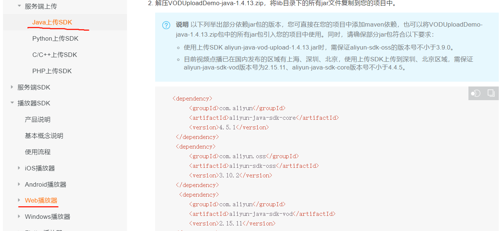

### 使用SpringCloud Alibaba来搭建项目的一些基础模块 拿来即用

### 版本

Nacos(自行下载) 1.2.1 
SpringBoot 2.2.5 
SpringCloud Hoxton.SR1
springcloud alibaba 2.2.0

### 模块描述
aliyunvod 阿里云视频点播相关模块 
有一个upload依赖不好依赖进来 建议官方文档可以下载Demo 然后把该依赖手动加载进来
也可以百度 有很多教程
然后只要开通相关视频点播控制台即可 上传视频都很简单（控制台得设置默认的转码 不然上传上去了 播放不来 自己看控制台点点操作一下就就能看到了）
播放视频可以有两种方式  一种根据上传成功后返回的videoid 去拿到播放地址 但是这个地址好像不是不变的 所以不能存到数据库
另外一个就是通过videoid+playauth的方式 模块中就是使用这种方式
其他的更多的可以看文档

[文档](https://help.aliyun.com/document_detail/53406.html?spm=a2c4g.11186623.6.1030.57a879dd9o3aU1)

主要看这两部分的即可 Demo下载也在文档里 

播放的话 使用Vue 可以使用文档那种方式 也有一个VueAliplayer组件 但是我的用了一下 一直不行也不知道为什么 就使用了文档的那种

sentinal 流量监控 限流等（自行下载sentinal dashboard）

common 公共模块  没有使用web依赖 所以无法使用@Slf4j 配置日志时需单独配置日志依赖

consumer provider 消费者、服务提供者  consumer中使用了restTamplate feign两种调用方式

gateway 网关 前端的请求都是到网关  由网关再去找对应的服务或者是消费者 

auth 权限模块 前后端分离的情况下 使用token  这个模块只做登录注册注销 授权在gatewat拦截请求判断权限
session问题 gateway的webflux的session与http的session不同  我也不知道如何解决 所以没有用到session了

exception 全局异常处理模块（能够处理Controller、Filter等抛出的异常  Filter抛出的异常处理见详解）

数据都是写死的 简单修改即可 并没有使用到数据库

### 详解
图片看不到 看博客里的吧
[博文](https://blog.csdn.net/qq_40799202/article/details/112189687)
